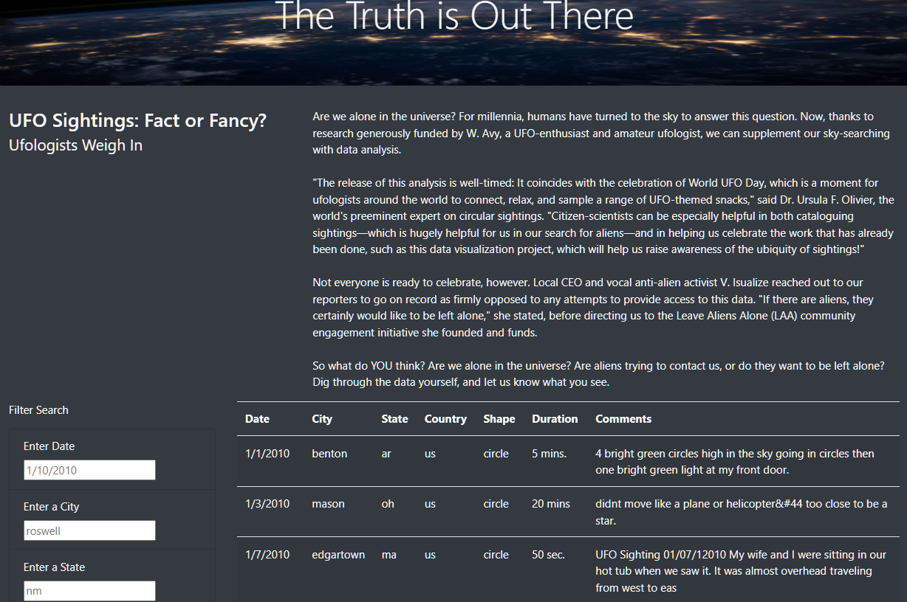
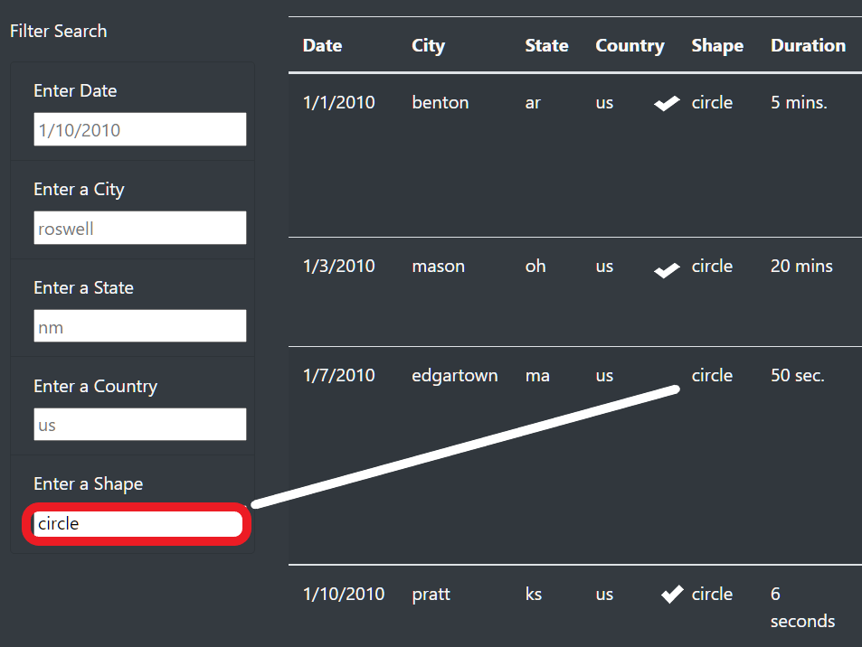

# UFOs - We are not Alone!

## Overview
The purpose of this analysis is to develop a website that explores UFO sightings across the nation. The project consists of loading static data from UFO sightings during January 2010 into a table on the sight, and filtering these reported sightings based on mulitple filters.

### Site Overview
Below is an image of the entire site. The site is aesthetically pleasing to view and is device agnostic so that the site resizes to meet the visitor's device, the overview article is engaging, and the data provided encourages visitors to learn more about UFO sightings using the filter fields.

## Results
The process for searching the data table on the UFO site is:
1. Click in a filterable box.
2. Type the item or items to filter on; in the example below we filter on the shape of a circle.
3. Once all filterable items are defined hit the enter key on the keyboard.
4. To clear the filtered items and restart, click "UFO Sightings" navigation bar at the top of the page.

### Site after filtering on shape

## Summary
The biggest drawback on the website is how to reset the filtered list to an initial state, where all filtered data in the table is reset. To clear any applied filters, it is necessary to scroll to the top of the website and click the "UFO Sightings" link in the navigation bar, which simply refreshes the webpage. The navigation bar is not intuitive, and is positioned in location that does not demostrate its relationship to the filtered table. Another drawback with the site's design is that there is nothing to suggest to the user that the enter key needs to be pressed to initiate filter selections. Aesthetically, the unfiltered data table displays all data in the table, and scrolls endlessly down the page.

### Recommended revisions
After test driving the new website, there are a few recommendations that would make the page more functional and intuitive to a visitor:
1. Remove the navigation bar from the top of the site and create a button titled "reset filters" below the filter boxes. On click, the button simply reloads the page, which is what the navigation bar does now, but a button clearly labeled is more intuitive.
2. Instead of assuming the visitor will know to press the keyboard enter key after entering filter criteria, create a button that indicates "filter my selections" for example. This way the user receives a prompt to indicate what must be done to start the filtering process.
3. The data table search areas are all lowercase. If a visitor were to seach on "CA" for California instead of "ca", no results would display. It would be better to code the filter boxes to ignore case sensitivity, thereby making the filters more flexible.
4. To enhance the site a bit, it might be better to limit the number of records that display in the initial data table to 10 or fewer. The endless scrolling might distract from the option to filter, and visitors miss the most import site functionality.
5. Placeholder text should disappear once one or more of the filter fields contain user input. As it is now, it appears all of the filters in the image below are set to a specific filter, when in reality, only one of the boxes was completed by the user: "Filter on shape". 

